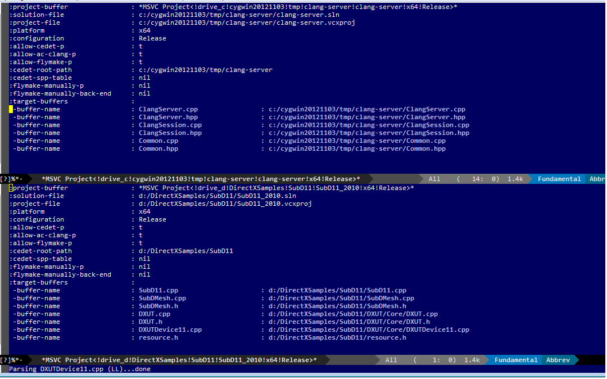
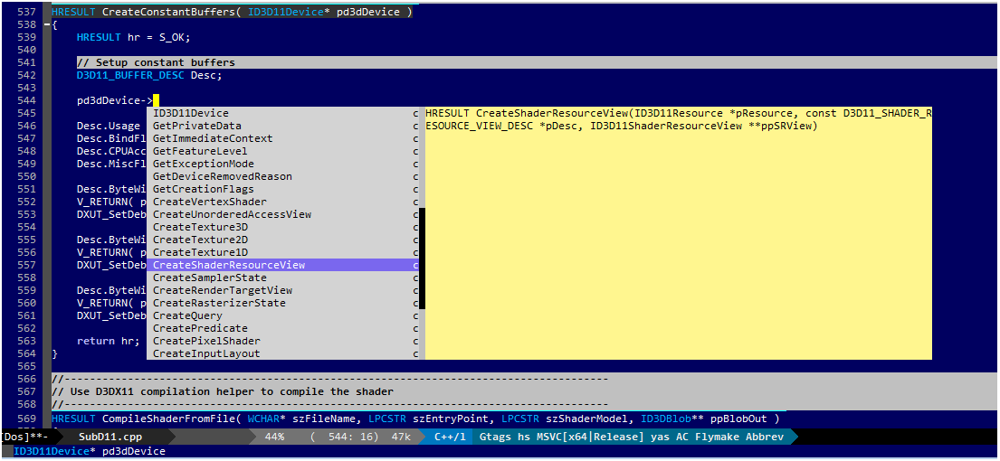
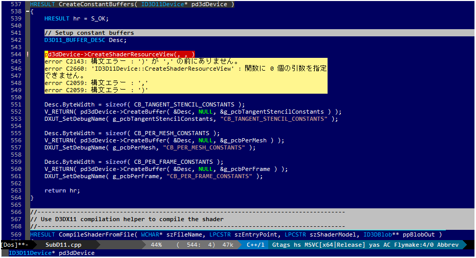
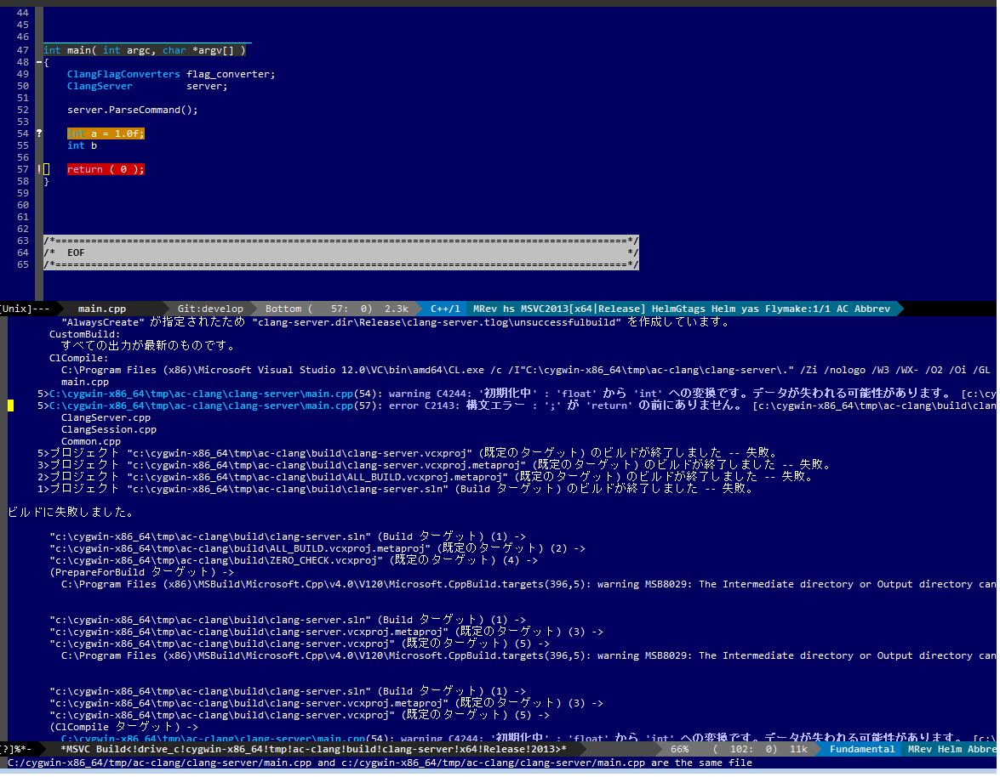

<h2>Table of Contents</h2>

<ul>
<li><a href="#sec-1">1. 提供される機能</a>
<ul>
<li><a href="#sec-1-1">1.1. プロジェクトの管理</a></li>
<li><a href="#sec-1-2">1.2. バージョンの異なるVisual Studio共存と利用</a></li>
<li><a href="#sec-1-3">1.3. IntelliSenseライクな補完機能</a></li>
<li><a href="#sec-1-4">1.4. flymakeによるシンタックスチェック</a></li>
<li><a href="#sec-1-5">1.5. 定義/宣言へのジャンプ＆リターン</a></li>
<li><a href="#sec-1-6">1.6. includeファイルへのジャンプ＆リターン</a></li>
<li><a href="#sec-1-7">1.7. プロジェクトorソリューションのビルド</a></li>
<li><a href="#sec-1-8">1.8. プロジェクトorソリューションからVisual Studioを起動</a></li>
</ul>
</li>
<li><a href="#sec-2">2. 必須環境</a></li>
<li><a href="#sec-3">3. 必須パッケージ</a></li>
<li><a href="#sec-4">4. 対応範囲</a></li>
<li><a href="#sec-5">5. 制限事項</a></li>
<li><a href="#sec-6">6. インストール</a>
<ul>
<li><a href="#sec-6-1">6.1. Emacsの起動設定</a></li>
<li><a href="#sec-6-2">6.2. Emacsパッケージの設定</a></li>
<li><a href="#sec-6-3">6.3. 初期化設定</a></li>
</ul>
</li>
<li><a href="#sec-7">7. 使用方法</a>
<ul>
<li><a href="#sec-7-1">7.1. プロジェクトのパースと登録1</a>
<ul>
<li><a href="#sec-7-1-1">7.1.1. 登録サンプル</a></li>
<li><a href="#sec-7-1-2">7.1.2. 必須プロパティ</a></li>
<li><a href="#sec-7-1-3">7.1.3. オプションプロパティ</a></li>
</ul>
</li>
<li><a href="#sec-7-2">7.2. プロジェクトのパースと登録2</a></li>
<li><a href="#sec-7-3">7.3. アクティブプロジェクトバッファ</a></li>
<li><a href="#sec-7-4">7.4. コード補完</a></li>
<li><a href="#sec-7-5">7.5. シンタックスチェック</a></li>
<li><a href="#sec-7-6">7.6. 定義/宣言へのジャンプ＆リターン</a></li>
<li><a href="#sec-7-7">7.7. includeファイルへのジャンプ＆リターン</a></li>
<li><a href="#sec-7-8">7.8. プロジェクト・ソリューションのビルド</a></li>
<li><a href="#sec-7-9">7.9. プロジェクト・ソリューションのビルドログからのエラーファイルへのジャンプ</a></li>
<li><a href="#sec-7-10">7.10. プロジェクト・ソリューションの再パース</a></li>
<li><a href="#sec-7-11">7.11. Visual Studio の起動</a></li>
</ul>
</li>
</ul>

# 提供される機能

Visual Studio プロジェクトファイルをパースすることにより、  
以下の機能が利用可能になります。  
※機能を利用するためにVisual Studioを起動しておく必要はありません。インストールされていればOK。  

## プロジェクトの管理

アクティブ化したプロジェクトに属するソースファイルがオープンされると管理バッファに自動登録されます。  
また、該当ソースファイルバッファは自動的に msvc-mode が on になります。  
プロジェクトを非アクティブ化すると、所属する全てのソースコードバッファの msvc-mode は off になります  

プロジェクト毎に管理バッファが作成される  
  

管理バッファ内  
  

## バージョンの異なるVisual Studio共存と利用

Visual Studio 2015/2013/2012/2010 などバージョンの異なるVisual Studioが複数インストールされている場合でも  
msvcで扱うソリューション・プロジェクト毎に使用するVisual Studioのバージョンを指定可能。  
これにより特定プロジェクトのみ古いバージョンのVisual Studioが利用可能になります。  

## IntelliSenseライクな補完機能

auto-completeとlibclangを用いてIntelliSenseライクな補完機能を提供します。  
プロジェクトのCFLAGSとincludeに基いて補完を行います。  
※libclangを利用せず ac-source-semantic を情報源とする補完も可能です。  

  

## flymakeによるシンタックスチェック

flymakeでプロジェクトのCFLAGSとソースコードに基いてシンタックスチェックを行います。  
flymakeのバックエンドはMSBuildです。  

  

## 定義/宣言へのジャンプ＆リターン

プロジェクト管理下にあるバッファではac-clangの機能を使って  
クラス/メソッド/関数/enumなどが定義/宣言されているソースファイルへジャンプすることが出来ます。  
GTAGSなどのタグジャンプ機能を使った事があればなじみのある機能だと思います。  

## includeファイルへのジャンプ＆リターン

プロジェクト管理下にあるバッファではCEDETの機能を使ってinclude記述されているファイルへジャンプすることが出来ます。  
また、特定操作によりジャンプ元へ戻る事も可能です。  
ジャンプ履歴はスタックされ戻る場合はポップされるので、複数回のジャンプが可能です。  
タグファイル系との差は事前にタグファイルを生成しておく必要がなくオンザフライでジャンプできるのが利点です。  

## プロジェクトorソリューションのビルド

Emacs上でアクティブ化したプロジェクトに対してビルドを実行できます。  
ビルドログはバッファに表示されます。  
ビルドログからエラーファイルへのジャンプも可能です。  

  

## プロジェクトorソリューションからVisual Studioを起動

Emacs上でアクティブ化したプロジェクトをVisual Studioを起動してオープンします。  
既に同一のプロジェクトがオープンされていても、再度Visual Studioを起動します。  
※Visual Studioのプロセスチェック等は行っていません。powershell経由でできないかテスト中。  

# 必須環境

-   GNU Emacs 24.1以上  
    24.1以降でのみ動作保証
-   shell  
    以下のいずれか  
    CYGWIN 64/32bit(推奨)  
    MSYS  
    CMD
-   Microsoft Windows 64/32bit
-   Microsoft Visual Studio Professional 2015/2013/2012/2010  
    CL.exe/MSBuild.exe 等を使います

# 必須パッケージ

Emacsで標準組み込み済み&インストールが必要なパッケージ  
msvcを M-x list-packages でインストールした場合は自動インストールされます。  
手動インストールのみ以下のパッケージをインストールする必要があります。  

-   CEDET(built-in)
-   flymake(built-in)
-   auto-complete
-   yasnippet
-   ac-clang

# 対応範囲

-   Emacs 64/32bit  
    CEDETが標準built-inになったバージョン以降で動作  
    
    Emacs は以下でテスト  
    <http://www.gnu.org/software/emacs/>  
    <https://github.com/chuntaro/NTEmacs64>  
    <http://sourceforge.jp/projects/gnupack/releases/?package_id=10839>

-   Shell  
    -   CYGWIN 64/32bit  
        $ uname -r  
        1.7.29(0.272/5/3)  
        CYGWINは64/32bit動作チェック済み
    -   MSYS  
        32bitのみ動作チェック済み
    -   CMD  
        cmdproxy,cmd動作チェック済み

-   Microsoft Windows 32bit/64bit  
    -   Vista/XP  
        未検証
    -   7  
        Professional 64 bit でのみ動作テスト
    -   8 & 8.1  
        Professional 64 bit でのみ動作テスト  
        CYGWIN動作に難アリ。  
        私の環境ではmakeやその他ツールが実行するたびにcoredumpしまくっていたので動作状況が芳しくありません。  
        msvcはbashしか使わないので動作に問題はないでしょうが、  
        grepなど他のツールを使ったりするでしょうから、8ではCYGWINがまともに動く方のみ使用するとよいでしょう。

-   Microsoft Visual Studio Professional  
    2015/2013/2012/2010 のみ動作チェック済み

-   SDK  
    下記SDKのサンプルプロジェクトでテスト。  
    対象SDKのAPIがac-clangにより補完されることを確認。  
    -   Windows SDK 7.0A/7.1  
        Visual Studio 2008のプロジェクトは2010に変換してテスト
    -   Direct X SDK(June 2010)  
        いくつかのサンプルでビルドテスト
    -   STL,std::tr1  
        テンプレートの展開などをテスト  
        boostは未テスト

# 制限事項

1.  プリコンパイル済みヘッダ(PCH)は使用不可  
    Visual Studio のPCHは使用できません。  
    PCHを利用するようにプロジェクトで設定されていてもMSVCでは無視されます。

# インストール

## Emacsの起動設定

GNU Emacs を CYGWIN(or MSYS)から起動できるようにします。  
.bashrc あたりに以下を記述しておくとよいでしょう。  

Emacsが配置されているパスを  
c:/emacs/64/emacs-24.3-20130503  
とします  

-   CYGWIN  
    
        alias emacs32-243-1='/cygdrive/c/emacs/64/emacs-24.3-20130503/bin/emacs.exe --debug-init'
        alias emacs='emacs32-243-1'

-   MSYS  
    
        alias emacs32-243-1='c:/emacs/64/emacs-24.3-20130503/bin/emacs.exe --debug-init'
        alias emacs='emacs32-243-1'

## Emacsパッケージの設定

以下のパッケージの設定が必要です。  
設定が実行される順番も下記の順番が望ましいです。  

-   CEDET(built-in)
-   flymake(built-in)
-   auto-complete
-   yasnippet
-   ac-clang

必要最低限の設定が行えるサンプルファイルを添付しているので、  
パッケージに関する自前設定がない人は添付ファイルをロードするなりコピペするなりしてください。  
すでに上記パッケージを利用しており自前の設定がある場合は、設定が競合していないかチェックをお勧めします。  
msvc/.minimal-config-sample/init.el を参照してください。  
init.el は ~/.emacs.d/ 以下に配置した場合に動作するよう記述されています。  
必要に応じてコードを抜き出してください。  

## 初期化設定

上記で説明した必須パッケージ群(CEDET/flymake/auto-complete/yasnippet/ac-clang)のロードも含めた初期設定を実行後に以下が実行される必要があります。  

基本的に以下の設定を .emacs に記述するだけで問題ないです。  
以下の記述はパッケージディレクトリが "~/.emacs.d" に配置された事を想定した記述なので自分の環境に合わせて修正してください。  

    (add-to-list 'load-path (expand-file-name "msvc/" "~/.emacs.d"))
    
    (require 'msvc)
    
    (setq w32-pipe-read-delay 0)
    (when (msvc-initialize)
      (msvc-flags-load-db :parsing-buffer-delete-p t)
      (add-hook 'c-mode-common-hook 'msvc-mode-on t))

# 使用方法

## プロジェクトのパースと登録1

下記パラメーターで関数を実行すると非同期実行されmsvc-dbに該当プロジェクトのデータベースが作成されます。  
プロジェクト管理・補完・シンタックスチェックなどはこのデータベースを元にして実行されます。  
データベース化されたプロジェクトは日付情報を参照しており、  
同一プロジェクトが再パースリクエストを受けた際に、  
プロジェクトが前回データベース化された日付より新しい場合のみデータベースを再構築します。  
※更新要因はプロジェクトのプロパティを変更した、SVNなどversion controlツールによる更新でプロジェクトファイルが新しくなった、など。  
プロジェクトがアクティブになると、該当プロジェクト名を持つバッファが作成されます。  
プロジェクトバッファ名は以下のフォーマットに基きます。  
**MSVC Project<\`db-name\`>**  
また、該当プロジェクトに属するソースコードがオープンされていたり、アクティブ中にオープンすると自動的にmsvc-modeが適用されます。  
msvc-modeが適用されたバッファはモードラインに **MSVC\`version\`[platform|configuration]** と表示されます。  

以下の関数でパース＆アクティブ化を行います。  
`(msvc-activate-projects-after-parse &rest args)`  

異なるプロジェクトを複数同時にアクティブ化可能です。  
個数制限は特に無いです。  
同一プロジェクトでプラットフォームとコンフィグレーションが異なるプロジェクトは同時にアクティブ化できません。  
この場合、最初にアクティブ化されたプロジェクトが有効になります。  
※対象となるソースバッファが１つしか存在ないことが理由。  
  バッファ自身はどのプロジェクトで、どんな platform|configuration で動作するのかを保持しているため。  

### 登録サンプル

    (msvc-activate-projects-after-parse :solution-file "d:/DirectXSamples/SubD11/SubD11_2010.sln"
                                        :project-file "d:/DirectXSamples/SubD11/SubD11_2010.vcxproj"
                                        :platform "x64"
                                        :configuration "Release" 
                                        :version "2013" 
                                        :toolset "x86_amd64"
                                        :md5-name-p nil
                                        :force-parse-p nil
                                        :allow-cedet-p t
                                        :allow-ac-clang-p t
                                        :allow-flymake-p t
                                        :cedet-root-path "d:/DirectXSamples/SubD11"
                                        :cedet-spp-table nil
                                        :flymake-manually-p nil
                                        :flymake-manually-back-end nil)

### 必須プロパティ

-   `:solution-file` or `:project-file`  
    いずれかが設定されていればOKです。  
    `:solution-file` のみを指定した場合  
    ソリューションに含まれる全てのプロジェクトがパースされ、アクティブ化されます。  
    以下の機能が追加されます。  
    アクティブ化したプロジェクトからソリューションのビルド呼び出しなどが可能になります。  
    ソリューションに登録されているプロジェクト数が少ない場合はこのスタイルで記述するのがよいでしょう。  
    `:project-file` のみの場合  
    指定したプロジェクトのみがパース・アクティブ化されます。  
    ソリューションに関連した機能は実行できなくなります。  
    `:solution-file` & `:project-file` で指定した場合  
    ソリューションのみを指定した場合と同じ効果を持ちますが、  
    ソリューションのみの場合は所属全プロジェクトがパース＆アクティブ化されるのに対し  
    こちらは指定したプロジェクトのみがパース＆アクティブ化されます。  
    ソリューションに登録されているプロジェクトが膨大な場合は、必要なプロジェクトだけをこのスタイルで記述するのがよいでしょう。
-   `:platform`  
    パース・アクティブ化するプラットフォームを指定します。  
    プロジェクトファイルに存在するプラットフォームでなければなりません。
-   `:configuration`  
    パース・アクティブ化するコンフィグを指定します。  
    プロジェクトファイルに存在するコンフィグでなければなりません。

### オプションプロパティ

-   `:version`  
    プロジェクトパース、ac-clangに渡されるCFLAGS生成、シンタックスチェック、ソリューションビルドに使用されるVisual Studioのバージョンを指定。  
    指定は文字列で行う。整数ではないので注意。  
    "2013" のように指定。  
    指定しない or nil場合、msvc-env-default-use-versionの値がセットされる。  
    msvc-env-default-use-versionは起動時に検出した最新のVisual Studioが割り当てられる。  
    msvc-initialize実行後にmsvc-env-default-use-versionの値を再セットすることにより標準で使用されるversionを変更可能。
-   `:toolset`  
    コンパイラプラットフォームを指定。  
    指定は文字列で行う。シンボルではないので注意。  
    指定しない or nil場合、msvc-env-default-use-toolsetの値がセットされる。
-   `:md5-name-p`  
    nil 推奨  
    t を設定した場合、下記制限に抵触するパスをmsvcで扱えるように、名前をMD5変換し衝突しない固定長名として扱う。  
    パース対象のプロジェクト名を含む絶対パスやパース後のデータベース名を含む絶対パスがMAX\_PATH(260文字)を超える場合はシェル上で扱えなくなる。  
    NTFSのUNICODEパスは32kBまで使用可能だが、shell(cmd.exe)上で扱えるのはMAX\_PATHが限度となる。
-   `:force-parse-p`  
    nil 推奨  
    すでにパース済みのプロジェクトであっても強制的にパースする。  
    主にデバッグ用途です。
-   `:sync-p`  
    nil 推奨  
    同期パースします。  
    ですので、プロジェクトファイルが多い場合は関数から戻るまで時間がかかります。  
    通常使用する分にはまず使用する必要は無いと思います。  
    主にデバッグ用途です。
-   `:allow-cedet-p`  
    t 推奨  
    CEDET機能を利用する  
    CEDETのプロジェクト管理に登録されsemanticが有効化されます。  
    nil の場合はincludeファイルへのジャンプが利用できなくなります。
-   `:allow-ac-clang-p`  
    t 推奨  
    ac-clang機能を利用する  
    libclangによるコード補完と宣言/定義へのジャンプが可能になります。  
    nil の場合はジャンプは利用不可になり、補完は情報源としてsemanticを利用するようになります。
-   `:allow-flymake-p`  
    t 推奨  
    flymake機能を利用する  
    MSBuildによるシンタックスチェックを利用します。
-   `:cedet-root-path`  
    `:allow-cedet-p t` の時だけ参照される  
    CEDET edeプロジェクト基準ディレクトリを指定する  
    指定したディレクトリに\*.edeファイルが生成される  
    大抵はプロジェクトファイルが配置されているディレクトリで問題ないです。  
    ただ、ソースコードの配置場所がプロジェクトファイル配置ディレクトリと同階層か子孫で無い場合は注意が必要になります。  
    この場合は同階層か子孫になるような共通の親ディレクトリを指定する必要があります。
-   `:cedet-spp-table`  
    nil 推奨  
    `:allow-cedet-p t` の時だけ参照される  
    semanticがソースをパースする際にリプレースさせたいワードの連想テーブル。  
    semanticが解釈できないdefineなどをリプレースするテーブルです。  
    semantic.cacheがうまく作成できない場合は設定が必要です。  
    以下記述サンプル  
    
        :cedet-spp-table '(
                           ("ALIGN"              . "")
                           ("FORCE_INLINE"       . "")
                           ("NO_INLINE"          . "")
                           ("THREAD_LOCAL"       . "")
                           ("DLL_IMPORT"         . "")
                           ("DLL_EXPORT"         . "")
                           ("RESTRICT"           . ""))
    
    詳細はCEDETマニュアル参照。
-   `:flymake-manually-p`  
    nil 推奨  
    `:allow-flymake-p t` の時だけ参照される  
    flymake のシンタックスチェックを自動起動しない  
    マニュアルチェックのみ有効
-   `:flymake-manually-back-end`  
    nil 推奨  
    `:allow-flymake-p t` の時だけ参照される  
    MSBuild 以外を使用する場合のみ指定する  
    現在は 'clang のみ対応  
    ac-clang の clang-server を利用してシンタックスチェックをする。  
    ※この場合マニュアル操作のみ  
    ※現在動作不良なので使用は非推奨

## プロジェクトのパースと登録2

~/.emacs.d/  
に  
.msvc  
というファイルを作成しておくと初期化時に実行されます。  
`msvc-activate-projects-after-parse` などはこのファイルに記述しておくとよいでしょう。  

## アクティブプロジェクトバッファ

アクティブなプロジェクトは以下のバッファ名が与えられます。  
**MSVC Project<\`db-name\`>**  

バッファに入ると `msvc-activate-projects-after-parse` で指定したパラメーターが確認可能です。  
また、現在開いているソースコードバッファでプロジェクトに所属しているバッファが `:target-buffers` に表示されます。  
バッファ名へカーソルを持っていきEnter入力を行うかマウスクリックを行うとバッファへジャンプ可能。  

このバッファを削除すると、関連する全ソースコードバッファのmsvc-modeがoffになります。  

## コード補完

利用可能な場所：msvc-mode onのソースコードバッファ上  

`:allow-ac-clang-p t` の場合補完可能になります。  

-   操作  
    -   補完  
        キー : \`.\`, \`->\`, \`::\`  
        説明 : 補完が自動起動します。

## シンタックスチェック

利用可能な場所：msvc-mode onのソースコードバッファ上  

`:allow-flymake-p t` の場合可能になります。  
buffer modified で自動起動します。  
"F5"でマニュアルシンタックスチェック。  
`:allow-flymake-p t` であれば `:flymake-manually-p nil` であってもオート・マニュアル併用が可能です。  

エラー表示スタイルは以下の変数にシンボルをセットすることにより変更が可能です。  
`(setq msvc-flymake-error-display-style DISPLAY-STYLE-SYMBOL)`  

-   `DISPLAY-STYLE-SYMBOL`  
    -   'popup  
        初期値です。  
        auto-completeパッケージ付属のpopup.elを使用してエラー表示をします
    -   'mini-buffer  
        ミニバッファにエラー表示をします
    -   nil  
        msvcはエラー表示を行いません  
        エラー表示手法は各個人のflymake設定に依存します

-   操作  
    -   マニュアルシンタックスチェック  
        キー : F5  
        説明 : マニュアルでflymakeを実行します
    -   エラー行へジャンプ(prev-error)  
        キー : M-[  
        説明 : エラー行へジャンプしてエラー内容をポップアップ表示します
    -   エラー行へジャンプ(next-error)  
        キー : M-]  
        説明 : エラー行へジャンプしてエラー内容をポップアップ表示します

## 定義/宣言へのジャンプ＆リターン

利用可能な場所：msvc-mode onのソースコードバッファ上  

ソースコードバッファでジャンプしたいワード上にカーソルをポイントしてジャンプします。  
ジャンプ履歴はスタックされており複数回ジャンプ後に最初のジャンプ元へ戻る事が可能です。  
msvc-modeによるジャンプ機能はac-clangで実装されており、  
あくまでC/C++かつVisual Studioプロジェクト管理化にあるファイルに限定されています。  
ですので、 luaなどその他スクリプト言語も使用しており GTAGS + CTAGS を利用するような場合はそれらと併用するのがよいでしょう。  

-   操作  
    -   定義/宣言へジャンプ  
        キー : M-.  
        説明 : ジャンプしたいワード上にカーソルをポイントしてキー操作をすると  
               定義/宣言がされているソースファイルをオープンし該当バッファの定義/宣言場所へカーソルをポイントします
    -   ジャンプ元へリターン  
        キー : M-,  
        説明 : 一つ前のジャンプ元へリターンします  
               この操作を繰り返す事によりジャンプ履歴をさかのぼれます

## includeファイルへのジャンプ＆リターン

利用可能な場所：msvc-mode onのソースコードバッファ上  

includeのライン上で"M-i" すると対象ファイルへジャンプします。  
ジャンプ履歴はスタックされており複数回ジャンプ後に最初のジャンプ元へ戻る事が可能です。  
※制限事項：プロジェクトで管理されていないインクルードファイルへジャンプするとM-Iで戻れません。  
  マニュアルで戻ってください・・。たとえば標準ライブラリ stdio.h, vectorやその他SDKのincludeなど。  

またジャンプできず  
`semantic-decoration-include-visit: Point is not on an include tag`  
というメッセージが表示される場合は  
="C-c , ,"= という操作を行い semantic に該当バッファの reparse を行わせます。  
これによりジャンプ可能になるはずです。  

-   操作  
    -   includeファイルへジャンプ  
        キー : M-i  
        説明 : ジャンプしたいincludeファイル上にカーソルをポイントしてキー操作をすると  
               includeファイルをオープンして該当バッファへジャンプします
    -   ジャンプ元へリターン  
        キー : M-I  
        説明 : 一つ前のジャンプ元へリターンします  
               この操作を繰り返す事によりジャンプ履歴をさかのぼれます

## プロジェクト・ソリューションのビルド

利用可能な場所：アクティブなプロジェクトバッファ・msvc-mode onのソースコードバッファ上  

C-f5 でプロジェクト・ソリューションのビルドが起動します。  
コマンドからの呼び出しは  
`(msvc-mode-feature-build-solution)`  

コマンドのみで提供されている機能  
`(msvc-mode-feature-rebuild-solution)`  
`(msvc-mode-feature-clean-solution)`  

-   操作  
    -   プロジェクト・ソリューションのビルド  
        キー : C-f5  
        説明 : プロジェクト・ソリューションのビルドが起動します

ビルドログ報告スタイルを設定可能  
以下の変数にシンボルをセットすることにより変更が可能です。(.msvcあたりで記述しておく)  
`(setq msvc-solution-build-report-display-timing DISPLAY-TIMING-SYMBOL)`  

-   `DISPLAY-TIMING-SYMBOL`  
         ビルドログバッファのウィンドウ表示タイミングを指定  
    -   'before  
        ビルドを開始した時点でウィンドウを分割して表示します。
    -   'after  
        ビルドが完了した時点でウィンドウを分割して表示します。
    -   nil  
        ログバッファは生成するがビルド完了後もフォアグラウンドにしない。

ビルドログバッファ内での表示方法を指定  
`(setq msvc-solution-build-report-realtime-display-p BOOLEAN)`  

-   `BOOLEAN`  
    -   t  
        ビルドログをリアルタイム表示
    -   nil  
        ビルド完了後に一括表示

## プロジェクト・ソリューションのビルドログからのエラーファイルへのジャンプ

利用可能な場所：プロジェクト・ソリューションのビルドログバッファ上  

-   操作  
    -   一つ前のエラー行へのジャンプ  
        キー : [  
        説明 : ビルドログで一つ前のエラー行へジャンプします
    -   一つ先のエラー行へのジャンプ  
        キー : ]  
        説明 : ビルドログで一つ先のエラー行へジャンプします
    -   一つ前のエラー行へのジャンプ＆該当エラーのファイル行を他ウィンドウへ表示  
        キー : M-[  
        説明 : ビルドログで一つ前のエラー行へジャンプして他ウィンドウへ該当ファイルのエラー行を表示します
    -   一つ先のエラー行へのジャンプ＆該当エラーのファイル行を他ウィンドウへ表示  
        キー : M-[  
        説明 : ビルドログで一つ先のエラー行へジャンプして他ウィンドウへ該当ファイルのエラー行を表示します
    -   エラーファイル行を表示  
        キー : C-z  
        説明 : 他ウィンドウを開きエラーファイル行を表示します
    -   エラーファイルへのジャンプ  
        キー : RET, mouseクリック  
        説明 : 他ウィンドウを開きエラーファイル行へジャンプします

## プロジェクト・ソリューションの再パース

利用可能な場所：どこでも  

msvcプロジェクトがアクティブな状態で、  
Visual Studio上でプロジェクトファイルを編集したり、  
バージョンコントロールによるアップデートでプロジェクトファイルが更新された場合に使用します。  
現在Emacs上でアクティブになっている全てのプロジェクトを再パース・再アクティブ化します。  
`(msvc-reparse-active-projects)`  

## Visual Studio の起動

利用可能な場所：アクティブなプロジェクトバッファ・msvc-mode onのソースコードバッファ上  

該当バッファが属するプロジェクト・ソリューションファイルをVisual Studioで起動します。  
※Windowsのファイル関連付け機能を利用しているだけなので、複数のVisual Studioがインストールされている場合は関連付け設定に従います。  

-   `(msvc-mode-feature-launch-msvs)`  
    バッファにソリューションが関連付けされていればソリューションで起動。  
    プロジェクトのみの場合はプロジェクトで起動。
-   `(msvc-mode-feature-launch-msvs-by-project)`  
         プロジェクトで起動。
-   `(msvc-mode-feature-launch-msvs-by-solution)`  
         ソリューションで起動。
